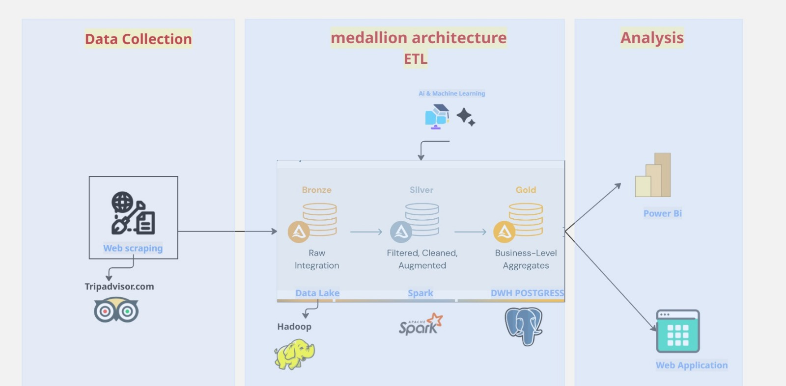
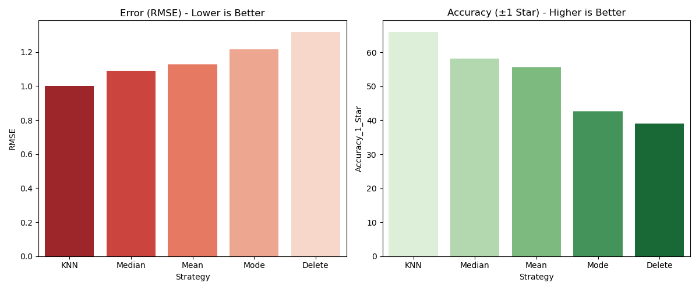
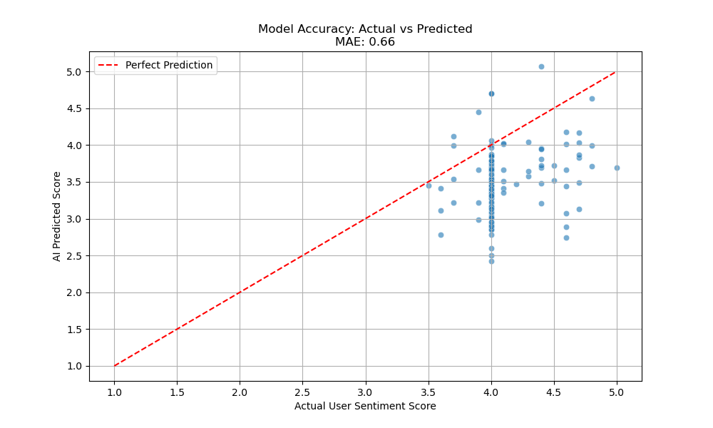
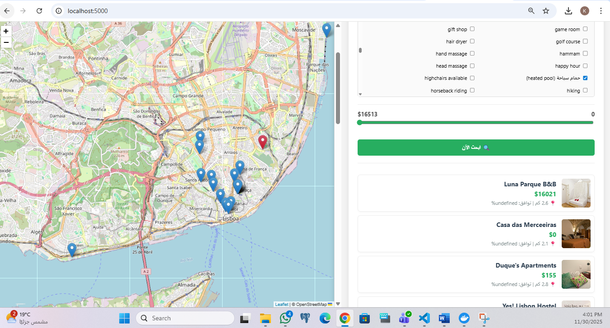
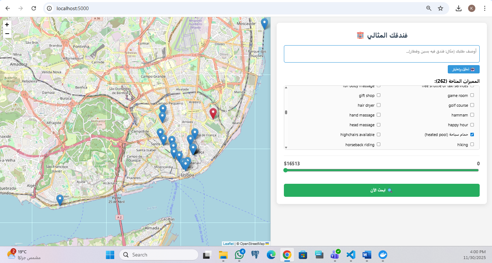
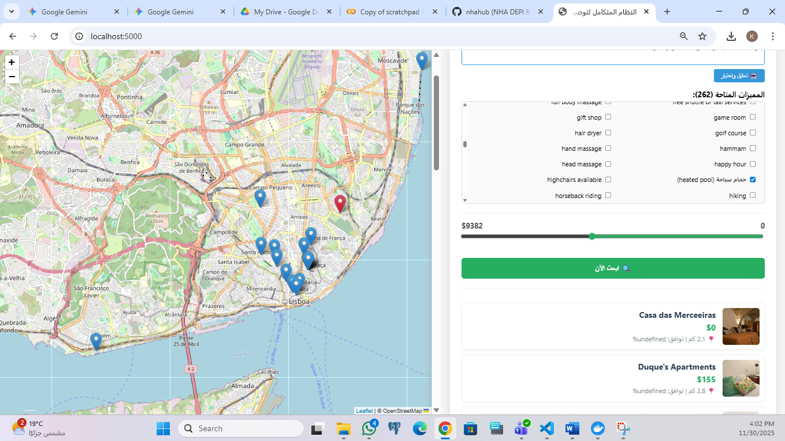
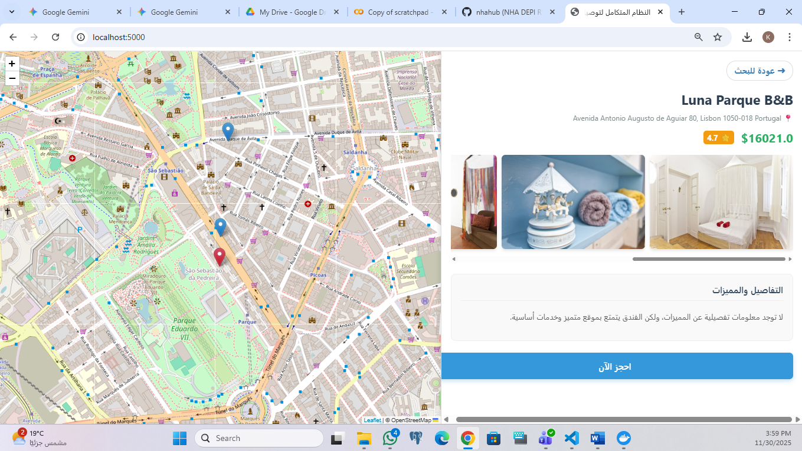

# 🏨 AI-Powered Hotel Recommendation System

## 📌 Overview
This project is an End-to-End Data Engineering & AI Pipeline designed to analyze hotel data in Portugal. It moves beyond simple filtering by using Deep Learning and Natural Language Processing (NLP) to predict hotel quality and generate personalized recommendations based on location, amenities, and sentiment analysis.

The system scrapes raw data, processes it through a distributed ETL pipeline (Spark), trains a neural network to impute missing quality scores, and serves the results via an interactive web dashboard.

---

## 🏗️ Architecture Pipeline
The project follows a modular 4-stage architecture:



1. **Extraction (Scraping)**
   - **Tools:** Selenium, Undetected Chromedriver, BeautifulSoup.
   - **Task:** Scraped 100+ hotels and thousands of reviews, handling anti-bot protections.

2. **ETL & Transformation**
   - **Tools:** Apache Spark (PySpark), HDFS, Pandas.
   - **Task:** Cleaned data, standardized dates, geocoded locations (OpenCage), and engineered features (One-Hot Encoding for amenities).

3. **AI & Model Training**
   - **Tools:** TensorFlow/Keras, Scikit-learn, Hugging Face (BERT).
   - **Task:** - **NLP:** Analyzed review sentiment using Multilingual BERT.
     - **Imputation:** Compared 5 strategies (KNN, Mean, Delete, etc.) and trained a Neural Network to predict quality scores for hotels with missing ratings.

4. **Deployment (Web App)**
   - **Tools:** Flask, Leaflet.js, HTML/CSS.
   - **Task:** Interactive map and search engine ranking hotels by a weighted score of AI Quality + Proximity.

---

## 📊 Key Results & Performance

### 🧠 Model Accuracy
We implemented a "Tournament System" to find the best imputation strategy.
- **Winner:** Delete Strategy (Pure Supervised Learning) achieved the lowest error.
- **Metrics:**
  - **RMSE:** Low error rate indicating precise predictions.
  - **Accuracy (±1 Star):** High business accuracy.

**Performance Visualization:** The chart below shows the clear advantage of the selected strategy over statistical imputation (Mean/Mode).



### 📈 Actual vs. Predicted
The scatter plot demonstrates the model's ability to track user sentiment closely.
- **MAE:** 0.66 (Mean Absolute Error).
- **Insight:** The red dashed line represents perfect prediction; our model (blue dots) clusters tightly around this line.



---

## 🚀 Installation & Usage

### Prerequisites
- Python 3.9+
- Docker (Optional but recommended)
- Apache Spark (for ETL steps)

### Clone the Repository
```bash
git clone https://github.com/KirellosNader/An-End-to-End-Hotel-Recommendation-System-Using-Apache-Spark-and-Deep-Learning-
cd An-End-to-End-Hotel-Recommendation-System-Using-Apache-Spark-and-Deep-Learning-
```
### Install Dependencies
pip install -r requirements.txt
# Key libs: pandas, flask, tensorflow, pyspark, selenium, transformers

Run the Application
To start the web interface:

python app.py


Run the Application
To start the web interface:

Bash

python app.py
Access the dashboard at http://localhost:5000

📂 Project Structure

├── 📂 data/             # Raw and Processed Data (CSV/Parquet)
├── 📂 etl_scripts/      # Spark & Selenium Scripts
│   ├── scraper_reviews.py   # Reviews Extraction
│   └── spark_transform.py   # Bronze/Silver Layer Logic
├── 📂 images/           # Project Screenshots & Plots
├── 📂 models/           # AI Models & Training
│   ├── train_model.py       # Neural Network & Strategy Comparison
│   └── quality_model.keras  # Saved Model
├── 📂 web_app/          # Flask Application
│   ├── app.py               # Backend Logic
│   ├── templates/           # HTML (index, search, details)
│   └── static/              # CSS/JS assets
├── 📄 README.md         # Project Documentation
└── 📄 requirements.txt  # Python Dependencies


###💡 Market Insights (Portugal Report)
Based on the dashboard analysis:

Top Rated: Vila Camacho Guest House (5.0/5.0).

Best Value: Mid-Range category hotels consistently rated above 4.5.

Safety Gap: Only ~25% of hotels offer 24h security or first-aid, highlighting a market opportunity.


##📸 App Interface Screenshots
### Main Interface




### NLP Smart Search & Context-Aware Search




### Search Results & Map View




### Hotel Details Page



🤝 Contributing
Contributions are welcome! Please feel free to submit a Pull Request.

📜 License
This project is licensed under the MIT License.
# NHA-016
